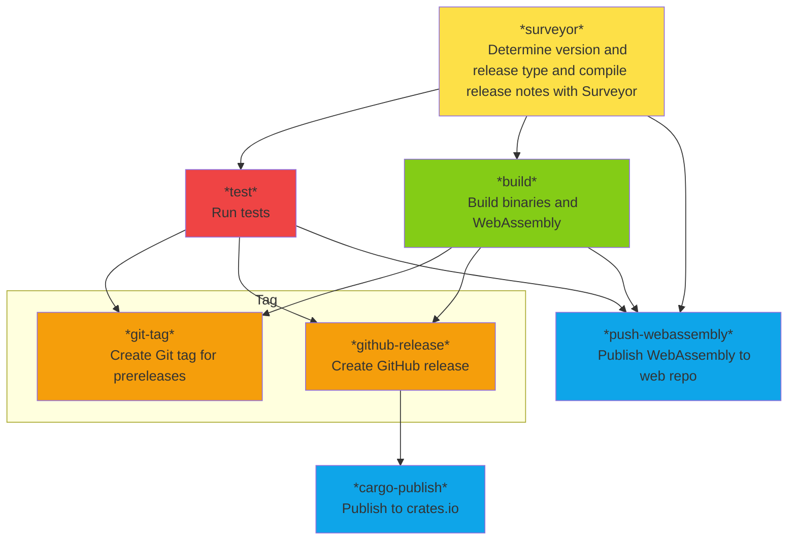
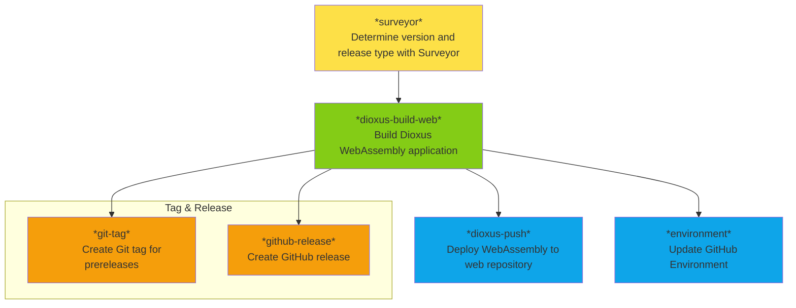
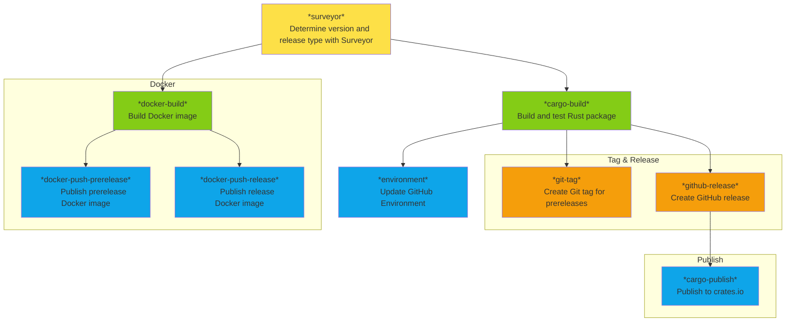

# GitHub Actions Workflows for Rust and .NET

Advanced, feature rich reusable workflows for GitHub Actions to fully automate the tedium of configuring CI/CD for Rust and .NET projects.

## .NET

[`ci-cd.yml`](.github/workflows/ci-cd.yml)

```mermaid
flowchart TD
    subgraph TESTS[Tests]
        test-ubuntu[*test-ubuntu*
        Run tests on Linux]:::TEST
        test-windows[*test-windows*
        Run tests on Windows]:::TEST
        push-tests[*push-tests*
        Publish Linux test results]:::PUSH
        push-tests-windows[*push-tests-windows*
        Publish Windows test results]:::PUSH
    end

    subgraph CLI[CLI Binaries]
        publish-cli-linux[*publish-cli-linux*
        Build CLI for Linux]:::BUILD
        publish-cli-windows[*publish-cli-windows*
        Build CLI for Windows]:::BUILD
        push-cli-linux[*push-cli-linux*
        Publish CLI for Linux]:::PUSH
        push-cli-windows[*push-cli-windows*
        Publish CLI for Windows]:::PUSH
    end

    release[*release*
    Determine the version number and compile release notes with Surveyor]:::RELEASE

    subgraph DOC[Documentation]
        documentation[*documentation*
        Build Docs]:::BUILD
        push-documentation[*push-documentation*
        Publish Docs]:::PUSH
    end

    subgraph LIB[Libraries]
        push-packages[*push-packages*
        Publish libraries to GitHub Packages]:::PUSH
        push-nuget[*push-nuget*
        Publish libraries to NuGet.org]:::PUSH
    end

    environment[*environment*
    Update the GitHub Environment]:::PUSH

    subgraph DOCKER[Docker]
        docker-build[*docker-build*
        Build Docker image]:::BUILD
        docker-push-prerelease[*docker-push-prerelease*
        Publish prerelease Docker image]:::PUSH
        docker-push-release[*docker-push-release*
        Publish release Docker image]:::PUSH
    end

    test-ubuntu --> release
    test-windows --> release
    publish-cli-linux --> release
    publish-cli-windows --> release
    documentation --> release

    release --> docker-build
    release --> push-packages
    release --> push-nuget
    release --> push-cli-linux
    release --> push-cli-windows
    release --> push-documentation
    release --> environment

    docker-build --> docker-push-prerelease
    docker-build --> docker-push-release

    test-ubuntu --> push-tests
    test-windows --> push-tests-windows
    push-tests --> push-tests-windows

    %% Styling with Tailwind colors
    classDef TEST fill:#ef4444
    classDef BUILD fill:#84cc16
    classDef RELEASE fill:#eab308
    classDef PUSH fill:#0ea5e9
```

## Bevy - Rust

[`ci-cd-bevy.yml`](.github/workflows/ci-cd-bevy.yml)

## Dioxus WebAssembly - Rust

[`ci-cd-dioxus-web.yml`](.github/workflows/ci-cd-dioxus-web.yml)

## Dioxus Fullstack - Rust

[`ci-cd-dioxus-fullstack.yml`](.github/workflows/ci-cd-dioxus-fullstack.yml)

